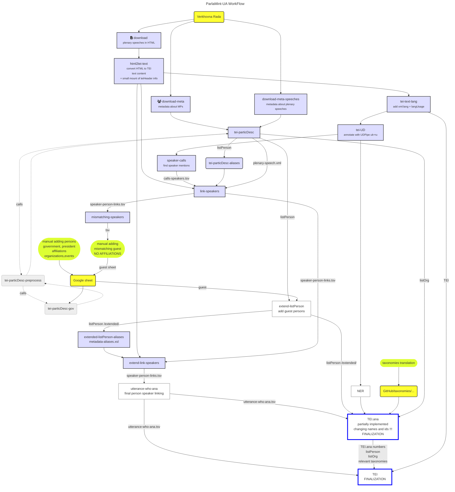

# ParlaMint-UA
Tools and samples of Ukrainian parliamentary proceedings encoded in ParlaMint format

```mermaid
---
title: ParlaMint-UA WorkFlow
---
graph TB
    VR(Verkhovna Rada):::in

    DM[fa:fa-users download-meta<br><small>metadata about MPs</small>]
    VR --> DM
    DMsp[download-meta-speeches<br><small>metadata about plenary speeches</small>]
    VR --> DMsp
    tei-particDesc[tei-particDesc]
    DM --> tei-particDesc
    DMsp --> tei-particDesc

    tei-particDesc -. calls .-> tei-particDesc-preprocess(tei-particDesc-preprocess):::gr
    tei-particDesc-preprocess -.-> tei-particDesc
    tei-particDesc-preprocess -. calls .-> tei-particDesc-gov(tei-particDesc-gov):::gr
    tei-particDesc-gov -.-> tei-particDesc-preprocess
    GOV([manual adding persons<br>government, president<br>affiliations<br>organizations,events]):::MANUAL
    GS(Google sheet):::in
    GOV --> GS
    GS --> tei-particDesc-gov
    tei-particDesc --listPerson--> tei-particDesc-aliases(tei-particDesc-aliases)

    DP[fa:fa-file-text download<br><small>plenary speeches in HTML</small>]
    VR --> DP

    HTML[html2tei-text<br><small>convert HTML to TEI<br>text content <br>+ small mount of teiHeader info</small>]
    DP --> HTML
    TEIlang[tei-text-lang<br><small>add xml:lang + langUsage </small>]
    HTML --> TEIlang
    TEIud[tei-UD<br><small>annotate with UDPipe uk+ru</small>]
    TEIlang --> TEIud
    SC[speaker-calls<br><small>find speaker mentions</small>]
    TEIud --> SC

    TEIner[NER]:::TODO
    TEIud --> TEIner

    link-speakers[link-speakers]
    HTML --> link-speakers
    SC --calls-speakers.tsv--> link-speakers
    tei-particDesc-aliases --> link-speakers
    tei-particDesc --plenary-speech.xml--> link-speakers

    mismatching-speakers[mismatching-speakers]
    link-speakers --speaker-person-links.tsv--> mismatching-speakers
    manMiss([manual adding<br>mismatching guest<br>NO AFFILIATIONS]):::MANUAL
    mismatching-speakers --tsv--> manMiss
    manMiss --guest sheet-->GS

    extend-listPerson[extend-listPerson<br>add guest persons]:::TODO
    tei-particDesc --listPerson--> extend-listPerson
    GS --guest--> extend-listPerson
    extended-listPerson-aliases[extended-listPerson-aliases<br>metadata-aliases.xsl]
    extend-listPerson --listPerson /extended/--> extended-listPerson-aliases

    extend-link-speakers[extend-link-speakers]
    extended-listPerson-aliases --> extend-link-speakers
    HTML --> extend-link-speakers
    link-speakers --speaker-person-links.tsv--> extend-link-speakers
    taxonomies-man([taxonomies translation]):::MANUAL --> taxonomies(GitHub/taxonomies/...):::in

    TEIana[TEI.ana<br>partially implemented<br>changing names and ids !!!<br>FINALIZATION]:::TODOfin

    utterance-who-ana[utterance-who-ana<br>final person speaker linking]:::TODO
    extend-link-speakers --speaker-person-links.tsv--> utterance-who-ana
    utterance-who-ana --utterance-who-ana.tsv--> TEIana
    extend-listPerson --listPerson /extended/--> TEIana
    TEIner --> TEIana
    taxonomies --> TEIana
    tei-particDesc --listOrg--> TEIana

    TEI[TEI<br>FINALIZATION]:::TODOfin
    utterance-who-ana --utterance-who-ana.tsv--> TEI
    TEIana --TEI.ana numbers<br>listPerson<br>listOrg<br>relevant taxonomies-->TEI
    TEIlang --TEI-->TEI
    
    classDef default fill:#ddf,stroke:#333,stroke-width:2px;
    classDef in fill:#ff3;
    classDef gr fill:#eee,stroke:#aaa,stroke-width:1px;
    classDef TODO fill:#fff,stroke:#aaa;
    classDef TODOfin fill:#fff,stroke:#00f,stroke-width:4px;
    classDef MANUAL fill:#df3,stroke-width:0px;
```
